## Project Structure Overview

- src/  
  - components/ → Reusable UI components  
  - pages/ → Application pages (Login, Dashboard, etc.)  
  - routes/ → Route definitions  
  - assets/ → Images and static files  

This project follows a modular React architecture for scalability and maintainability.

## Week 1 – Scheduling & Setup (Completed)

### UI Theme Setup
A consistent UI theme has been implemented using Tailwind CSS.  
The project uses a unified color palette (Primary, Secondary, Accent) and typography to ensure visual consistency across the platform.

📸 Screenshot: UI theme and dashboard layout  
<!-- Screenshot here -->

---

### Meeting Scheduling Calendar
A meeting scheduling calendar has been integrated using FullCalendar.  
This calendar allows entrepreneurs to visually view scheduled meetings and upcoming discussions.

Key highlights:
- Monthly calendar view
- Clean and responsive UI
- Ready for future availability and booking logic

**📸 Screenshot:** Calendar integrated into Entrepreneur Dashboard  
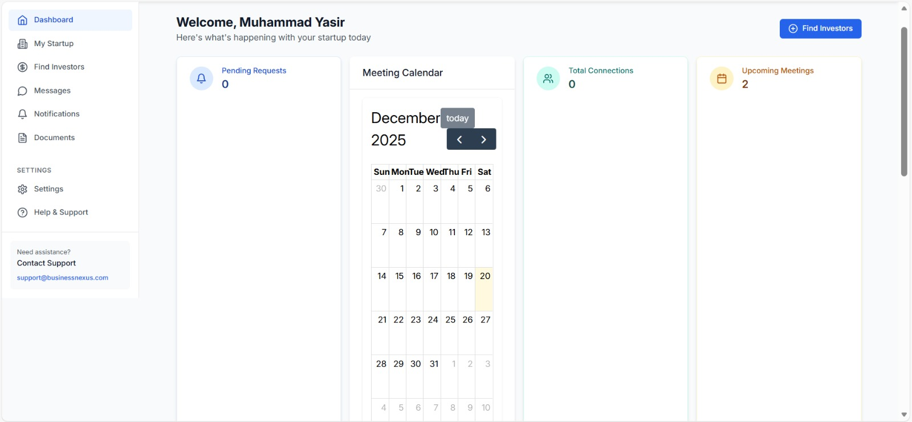

---

### Sample Meetings (Demo Events)
Dummy meetings have been added to demonstrate calendar functionality:
- Investor Meeting – 20 Dec
- Pitch Discussion – 22 Dec
- Follow-up Call – 25 Dec

**📸 Screenshot:** Calendar with sample meeting events  
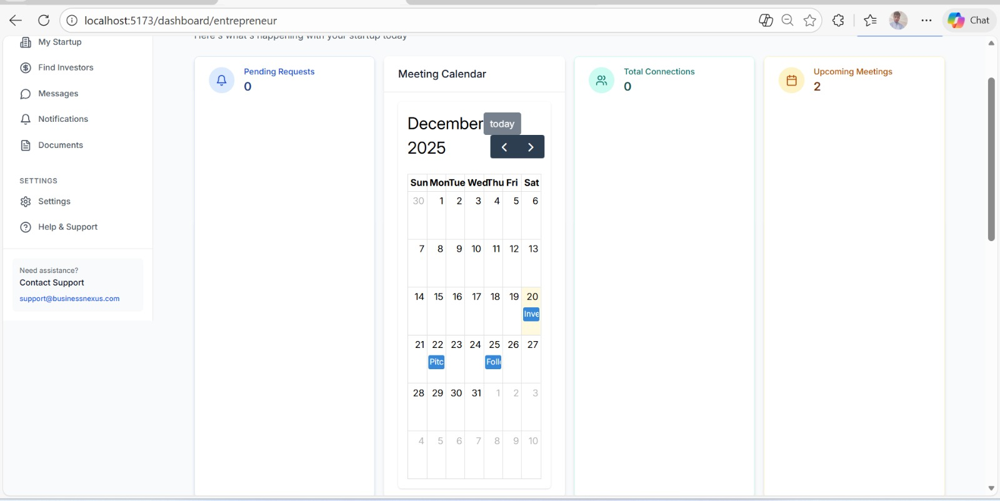

## 🗓️ Week 1 – Scheduling & Setup (Summary)

In Week 1, the foundation of the project was established with a strong focus on UI setup and meeting scheduling functionality. A consistent and scalable UI theme was implemented using Tailwind CSS, ensuring uniform colors, typography and layout across the application. This provided a solid visual base for future feature development.

The core highlight of this week was the integration of a meeting scheduling calendar into the Entrepreneur Dashboard. Using a clean and responsive calendar UI, entrepreneurs can visually track meetings and discussions. Demo meeting events were added to showcase functionality and simulate real-world usage scenarios, making the feature easy to understand and review.

Overall, Week 1 successfully laid down the structural and visual groundwork of the application, preparing the platform for advanced collaboration features in the upcoming phases.

-brightgreen?style=for-the-badge)

-------------

## Week 2 – Video Calling & Collaboration (In Progress)

### Video Calling UI (Mock)
A video calling interface has been added as a frontend mock to demonstrate real-time collaboration capabilities between investors and entrepreneurs.

Features included:
- Video call screen layout
- Mic on/off toggle
- Video on/off toggle
- End call button
- Clean and minimal UI for demo purposes

**Screenshot:** Full page dashboard with video call section  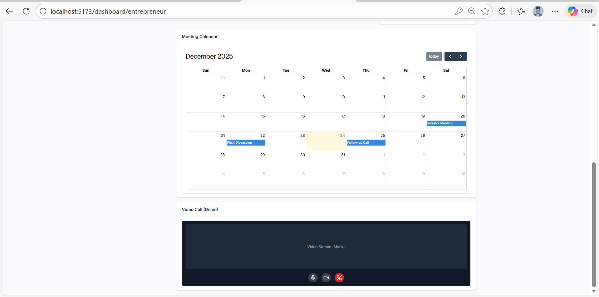

**Screenshot:** Video calling mock interface  
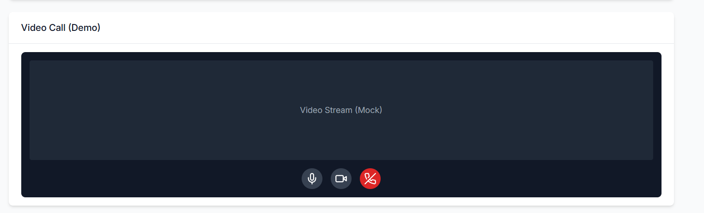

---------------
### Document Chamber (Mock)
A document chamber UI has been added to manage deal-related files such as proposals and agreements.  
The interface includes document listing, upload button (mock), and status labels like Draft, In Review and Signed.

**📸 Screenshot:** Document Chamber UI  
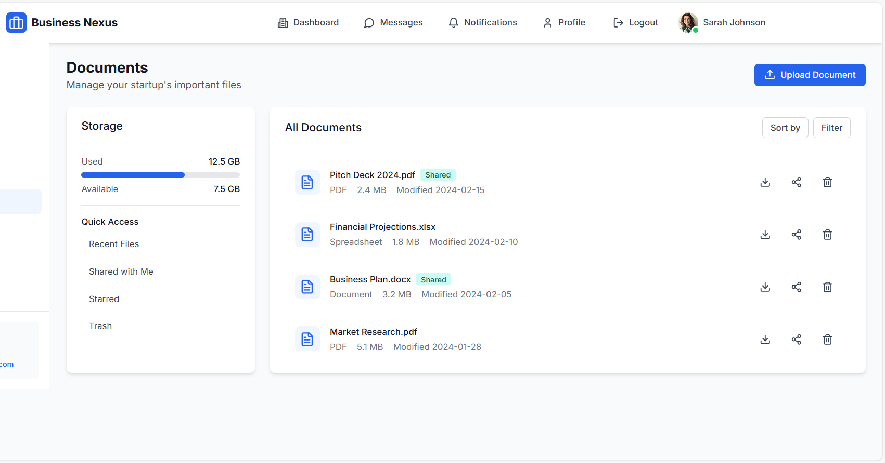

##  Week 2 Completed – UI Enhancements & Features

**Status:** Completed successfully

In Week 2, key UI features were implemented and integrated smoothly into the Nexus project. The focus was on improving usability, visual consistency and core dashboard functionality.

### Highlights:

*  **Calendar Dashboard** integrated and displayed correctly
*  **Video Call Mock UI** added for meeting simulation
*  **Document Chamber UI** implemented for managing startup documents
*  **Consistent color theme & layout** applied across new components

All features were tested locally, screenshots were captured and changes were pushed to GitHub.

 *Week 2 tasks are fully completed and ready for review.*

-brightgreen?style=for-the-badge)

##  Week 3 – Payment UI & Transactions (In Progress)

###  Overview
In Week 3, the focus is on implementing the **Payment UI** for the Nexus Platform.  
This module allows users to view and interact with a clean, user-friendly payment interface, preparing the system for future payment integrations.

---

### 💳 Payment UI Features
- Dedicated **Payments page** accessible from the sidebar
- Card-based payment layout (UI mock)
- Consistent design using Tailwind CSS theme
- Fully responsive layout inside Dashboard

---

###  Implementation Details
- New Payments page created and connected via routing
- Sidebar navigation updated to include Payments
- Dashboard layout reused for consistency
- UI prepared for future backend/payment gateway integration

---

### 📸 Screenshots
> Below screenshots demonstrate the completed Payment UI setup:

- **Payment Card UI / Slide**  
  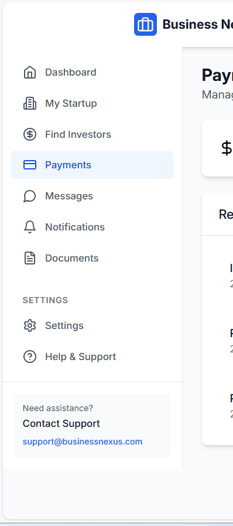

- **Payment Page – Full View**  
  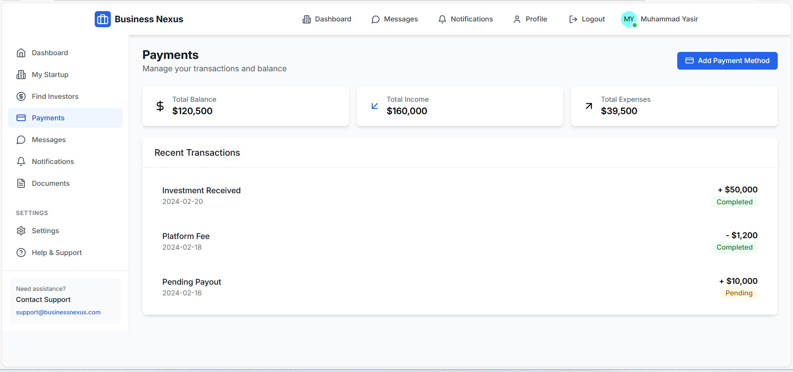

---

### 📅 Status
✅ Payment UI created  
✅ Routing configured  
✅ Screenshots documented  

⏳ Next: Payment flow logic & enhancements

### 💼 Payment Actions (Deposit / Withdraw / Transfer)

The following screenshots demonstrate the **mock payment actions** implemented as part of the Payment UI.  
These actions are UI-based simulations designed to represent real-world payment workflows.

- **Wallet Overview & Add Payment (Mock UI)**  
  Displays the wallet balance with an option to add funds.
This screen provides a quick overview of available payment balance inside the wallet.  
  

- **Payment Actions: Deposit / Withdraw / Transfer (Mock UI)**  
  Shows available payment actions including deposit, withdraw and transfer.
These actions are UI simulations representing common financial operations.
  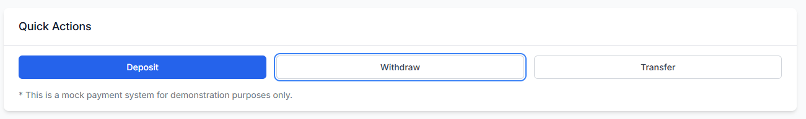

- **Recent Transactions List (Mock UI)**  
  Represents transferring funds between users within the platform (UI mock).  
  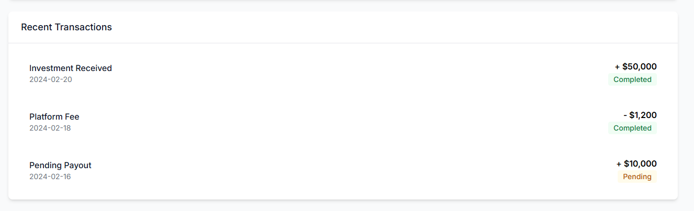

---

### 📸  Screenshots

Below are the key screenshots demonstrating the completed features:

Entrepreneur Dashboard – Funding Request View
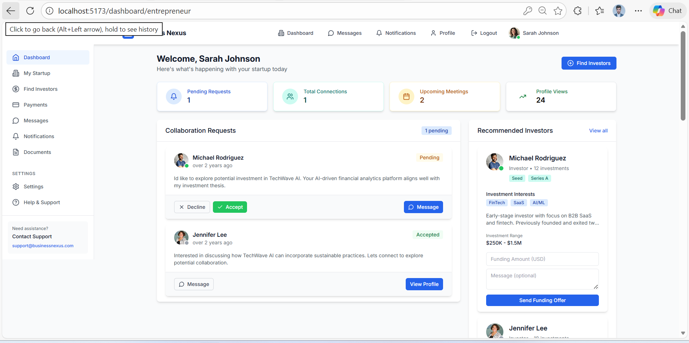

Payments Page – Recent Transactions (Sender → Receiver visible)
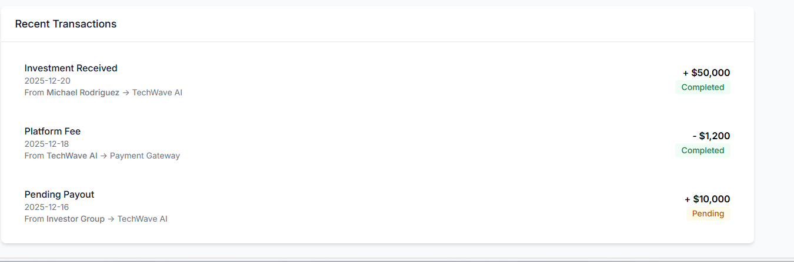

Funding Offer Form (Investor Side)

## 🤝 Funding Deal – Investor → Entrepreneur (Mock Flow)

The following screenshots demonstrate the mock funding deal flow from an investor to an entrepreneur.
This completes the simulated investment lifecycle on the platform.

Entrepreneur Dashboard – Funding Request View
Shows pending funding requests received from investors on the entrepreneur dashboard.

Funding Offer Card (Zoomed View)
Displays an individual funding offer card with Pending status and available actions.

Send Funding Offer Section (Investor Side)
Investor can enter funding amount, add an optional message and send a funding offer.

### 📝 Summary
Entrepreneurs can view funding offers sent by investors and take action (Accept / Decline).
This completes the mock funding deal flow between Investor and Entrepreneur.

------
## 🔐 Milestone 6
**Security & Access Control
(Completed)**

 ***Overview*** 
Milestone 6 focuses on improving frontend security and access control for the Nexus platform.
This module enhances the authentication flow with role awareness and additional security layers.

 ***Implemented Features*** 
• Role-based Login UI (Investor / Entrepreneur) with separate dashboard redirects
• Multi-step Login Flow with a mock **OTP (2FA)** screen for enhanced security
• Clean, responsive authentication UI using reusable components

### 📸 Screenshots
* • Login Page (Role Selection)
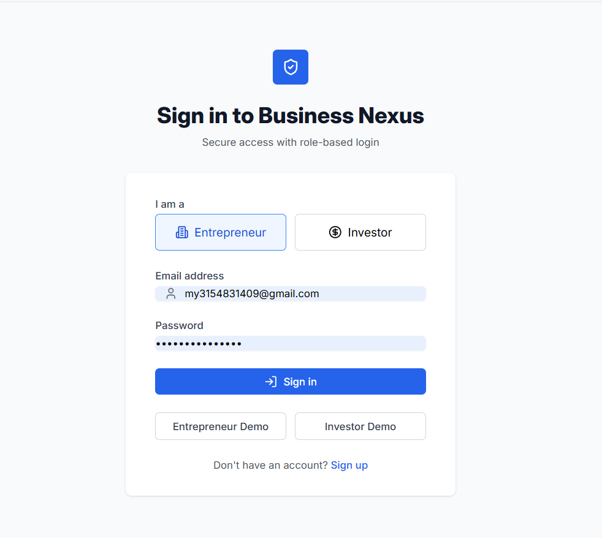

* • OTP Verification Screen* 
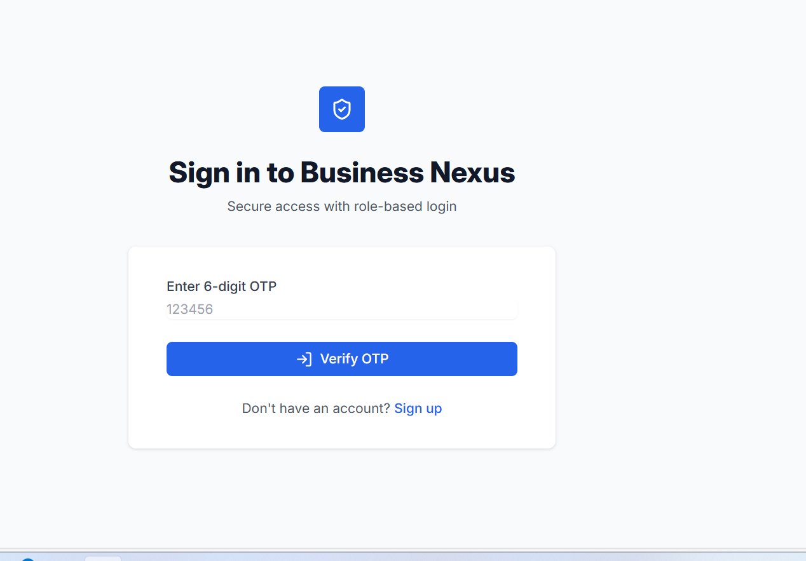

• Successful Redirect to Role-based Dashboard

 Module Status
These updates mark the start of Module 6 and prepare the platform for stronger authentication and access control mechanisms.

 
---------------------------------

## Milestone 7: Integration & Demo Preparation

In this milestone, we focused on integrating all newly developed modules into the main application flow. 
All major features such as Payments, Security & Access Control, and role-based dashboards are now accessible directly from the sidebar navigation.

The application layout ensures clear separation between Entrepreneur and Investor panels, improving usability and navigation clarity.
Basic responsive checks were performed to ensure proper layout on different screen sizes.

This milestone also prepares the platform for final demo and walkthrough by adding a dedicated Platform Demo entry.
Screenshots below demonstrate successful integration of modules and navigation flow.

## Screenshots Section
### Dashboard Layout (Full Sidebar View)
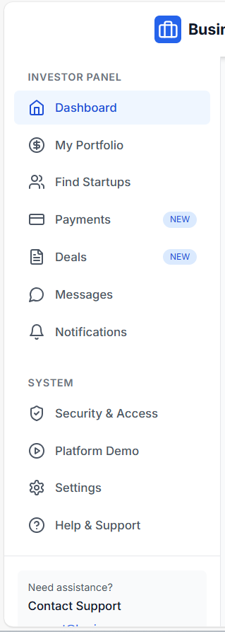

This screenshot shows the complete dashboard sidebar with role-based navigation, including Payments, Security & Access and Platform Demo modules.

### Entrepreneur Panel dashbord

This view highlights the Entrepreneur dashboard with startup management, investor discovery, payment and document access.

### Investor Panel View (Deals Included)
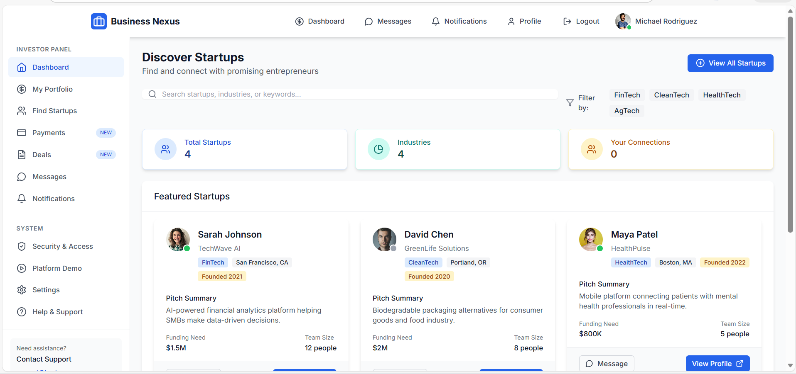
This screenshot demonstrates the Investor dashboard, including portfolio access, startup discovery, payments and the Deals module.

### Security & Access Control
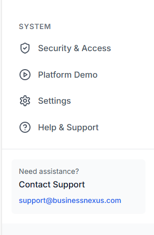

This screen represents the Security & Access module featuring password strength indicators, access-related settings, and role-based UI control.

